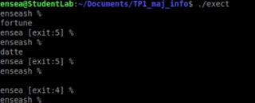
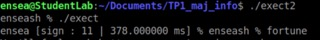
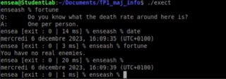

# TP1 by DASQUE Myriam and CARONELLO Marie

  
You are on the Myriam and Marie's Github. This is our Lab1, and the objective is to develop a tiny shell, that displays exit codes and execution times of launched programs.

### 1. Display a welcome message, followed by a simple prompt.

To display the message, we create a string of caracters. We don't use 'printf' but 'write' to display the sentence.
We get the next message :

 
  
  

Moreover we can observe that if we are 'exit' after the prompt we exit the program. In the opposite if we have an another word, the program waits.

### 2. Execution of the entered command and return to the prompt.

The new programm waits after the prompt, a memorized function. We can test our program with differents functions as fortune, date ...

 
  
  

The program permits to get the date with 'sate' or with nothing after the prompt. Afer prompt, any function that memorized, is applied as we can see on the screenshot.

### 3. Management of the shell output with the command ”exit” or with <ctrl>+d.

In this part we want to exit the program with the command 'exit and 'ctrl' + d. We use fork() because we need a father to continue our program even when we enable the commande "exit". The child execute the command "exit" and the father wait the child. So we stay in "enseah" even we enable the command "exit".

 
  
  

The second result is getting by 'ctrl' + d. We can observe all our progress with the following screenshot.

 
  
  

Indeed we can applied a lot of functions as 'date' or 'fortune' and exit the prompt 'enseash %' with 'exit' or ctrl+d. 

### 4. Display the return code (or signal) of the previous command in the prompt.

Now we want to know which "exit" for which program. To realise the function we are going to use the macro "WEXITSTATUS" is used to extract the exit code of a child process that has terminated normally. We define sevral exit for differents functions like date. We observe the next answer.

 
  
  

We observe that functions "datte" and "forutne" are associate to "exit 5" whereas when we push the enter button we get "exit 4". We have well different exit for different functions.
In this screenshot we observe the non-display of program execution. It is because the lign of display (exit) is before the ligne of display execution. We change that problem. To see the solution with "sign" , in a new file we create a new function.

 
  
  

### 5. Measurement of the command execution time using the call clock_gettime.

Futhermore we want to display the command execution time. We use a new function clock_gettime for this new program. We can observe that different functions don't have the same execution time.

 
  
  

So we can see the difference betwenn the function "date" that last 3ms and the function "fortune" that last 20ms.

### 6.Execution of a complex command (with arguments).

We want to execute program in our own shell with differents arguments
