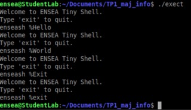
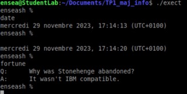
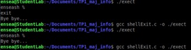
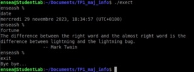

# TP1_maj_info

  
You are in the Myriam and Marie's Github. This is our Lab1, and the objective is develop a tiny shell, that displays exit codes and execution times of launched programs.

### 1. Display a welcome message, followed by a simple prompt.

To display the message, we create a string of caracters. We don't use 'printf' but 'write' to display the sentence.
We get the next message :

 
  
  

Moreover we can observe that if we are 'exit' after the prompt we exit the program. In the opposite if we have an another word, the program waits.

### 2. Execution of the entered command and return to the prompt.

The new programm waits after the prompt, a memorized function. We can test our program with differents functions as fortune, date ...

 
  
  

The program permits to get the date with 'sate' or with nothing after the prompt. Afer prompt, any function that memorized, is applied as we can see on the screenshot.

### 3. Management of the shell output with the command ”exit” or with <ctrl>+d.

In this part we want to exit the program with the command 'exit and 'ctrl' + d.

 
  
  

The second result is getting by 'ctrl' + d. We can observe all our progress with the following screenshot.

 
  
  

Indeed we can applied a lot of functions as 'date' or 'fortune' and exit the prompt 'enseash %' with 'exit' or ctrl+d. 

